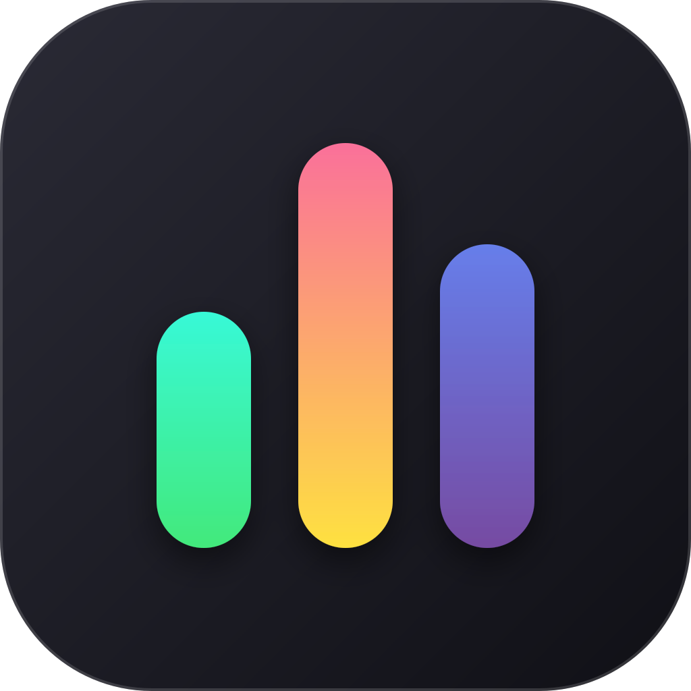
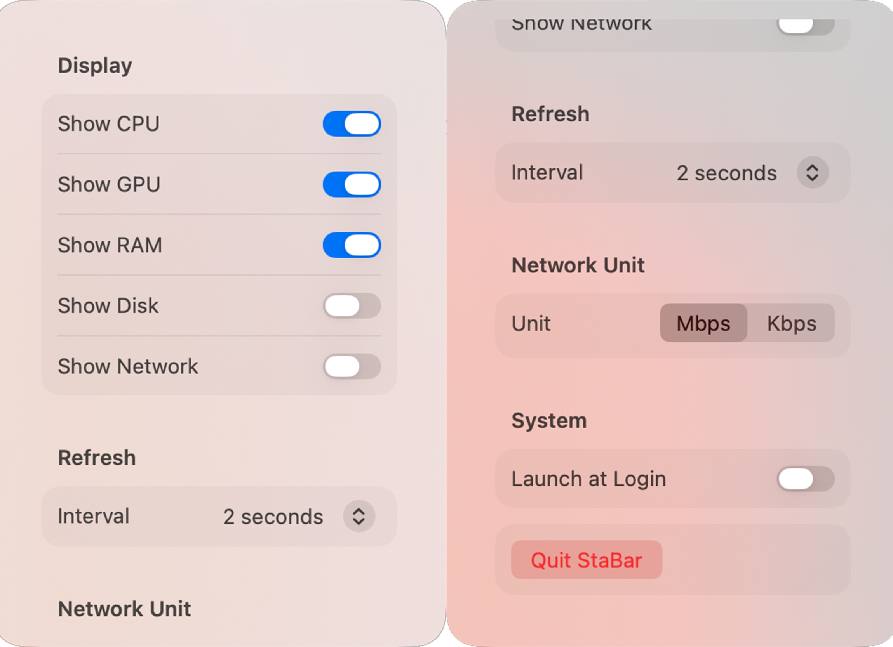
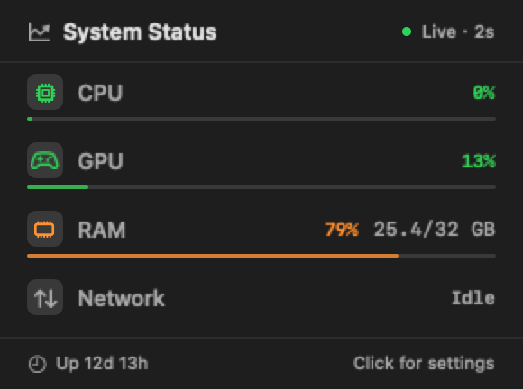
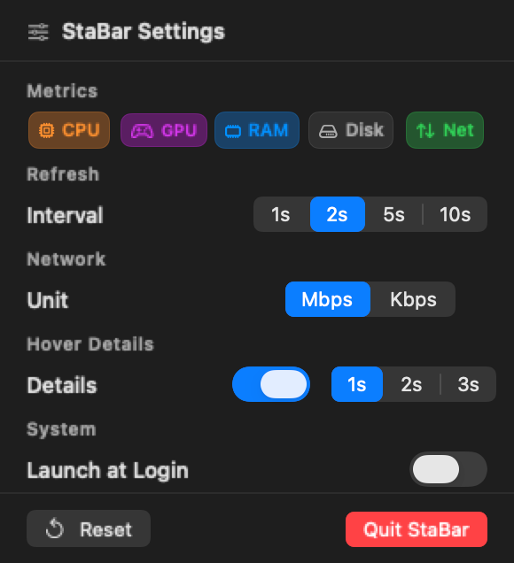

# StaBar

**[English](README_EN.md) | [中文](README.md)**

A lightweight native macOS menu bar system monitor built with Swift and SwiftUI.

<p align="center">
  <br>
  <br>
  
  
  
</p>

## Features

- **Real-time monitoring** — CPU, GPU, RAM, Disk, and Network metrics at a glance
- **Column layout** — Each metric in its own column, label on top and value below, perfectly aligned
- **Locked width** — Every column is sized for its worst case, so the menu bar icons **never shift** while the numbers change
- **Hover details** — Rest the pointer on the menu bar item for 2 seconds (configurable: 1/2/3s) to open a drop-down panel: one metric per row, larger type, values in full, closes automatically when the pointer leaves
- **Full values** — RAM and Disk show percentage *and* used/total (e.g. `85%  27.3/32 GB`); network speeds are never truncated (e.g. `↓12.4 ↑3.1 Mbps`)
- **Status colours** — Apple's semantic colours, the same family Finder uses for its tags, with green / orange / red load levels
- **One-page settings** — Click the menu bar item for a panel that fits every option without scrolling
- **Metric toggles** — Five colour-coded chips switch CPU, GPU, RAM, Disk and Network on or off
- **Refresh interval** — 1, 2, 5 or 10 seconds
- **Network units** — Kbps or Mbps
- **Launch at Login** — Automatic startup via SMAppService
- **Native performance** — Pure Swift/SwiftUI with minimal resource footprint
- **macOS design** — UI consistent with macOS Tahoe aesthetics

## The Two Panels

The menu bar itself stays compact; the details live in two panels:

| Hover detail panel | Settings panel |
| --- | --- |
|  |  |

**Hover detail panel** (opens after a 2 second hover)

- Appears after the pointer rests on the menu bar item for **2 seconds**; it closes as soon as the pointer moves away or you click elsewhere
- **Never steals focus** — the app in front stays in front while the panel is open
- One metric per row: icon, name, percentage and a slim usage bar
- RAM/Disk add `used / total`; Network shows `↓ download ↑ upload unit`
- Values and bars are coloured by load: **green < 60%**, **orange 60–85%**, **red ≥ 85%**; supporting figures such as capacity stay grey
- The footer shows system uptime and the current refresh interval

**Settings panel** (opens on click)

- A compact single page — every setting is visible without scrolling
- Five colour-coded chips at the top toggle the metrics; everything else is one row per item
- The footer holds **Reset** (restore defaults) and **Quit StaBar**

Both panels share the same 290pt width, the same material background and the same palette, so switching between them never produces a visual jump.

## System Requirements

- **macOS 14 Sonoma** or later
- Apple Silicon (M1/M2/M3) recommended; Intel Macs need test.

## Installation

1. Download the latest `StaBar.dmg` from [GitHub Releases](../../releases)
2. Open the DMG and drag **StaBar.app** to your **Applications** folder
3. Launch StaBar from Applications

> **Note:** StaBar is not code-signed or notarized. On first launch, macOS may block the app. To allow it:
>
> **System Settings → Privacy & Security → scroll down → click "Open Anyway"**

## Building from Source

Requires **Xcode 15+** with the macOS 14 SDK.

```bash
git clone https://github.com/wpttt/stabar.git
cd stabar

# Build Release configuration
/Applications/Xcode.app/Contents/Developer/usr/bin/xcodebuild \
  -scheme StaBar \
  -configuration Release \
  SYMROOT=./build build

# Launch the app
open build/Release/StaBar.app
```

To run the unit tests:

```bash
/Applications/Xcode.app/Contents/Developer/usr/bin/xcodebuild \
  test -scheme StaBar -destination 'platform=macOS'
```

While developing, a helper script builds the app, terminates the running instance and launches the fresh build — then verifies that the running process really is the newest one:

```bash
./scripts/relaunch-dev.sh
```

> If `xcode-select -p` points at CommandLineTools, run
> `sudo xcode-select -s /Applications/Xcode.app/Contents/Developer` first,
> or prefix commands with `DEVELOPER_DIR=/Applications/Xcode.app/Contents/Developer`.

To create a DMG for distribution:

```bash
./scripts/create-dmg.sh
```

The DMG creation script automatically:
- Compiles the app
- Generates the app icon in all required sizes
- Applies the custom icon to the DMG file itself
- Sets the volume icon for the mounted DMG

## Usage

1. **Launch** — StaBar runs in the menu bar with no main window
2. **View metrics** — System metrics appear in the menu bar as independent columns
3. **Hover for details** — Rest the pointer for ~2 seconds to open the detail panel with the complete numbers for every metric
4. **Open settings** — Click the menu bar item to open the settings panel
5. **Configure** — Toggle metrics, set the refresh interval and network units, and enable/disable the hover panel with its delay
6. **Auto-start** — Enable "Launch at Login" to start StaBar automatically on login

## Known Limitations

1. **GPU monitoring** uses the IOAccelerator private API, which may not be available on every machine. When no reading is available the menu bar shows `—` and the detail panel shows `N/A`; the column keeps its place so the menu bar width never changes.
2. **Load colour thresholds are fixed** at 60% / 85% and are not configurable.
3. **Not code-signed** — Users must manually trust the app in System Settings on first launch.
4. **macOS 14+ only** — StaBar uses modern SwiftUI features introduced in macOS 14.

## License

This project is licensed under the [MIT License](LICENSE).

## Acknowledgments

- Inspired by [Stats](https://github.com/exelban/stats) by exelban — the most comprehensive macOS system monitor
- [Rectangle](https://github.com/rxanson/Rectangle) by rxhanson — for menu bar and login item patterns
