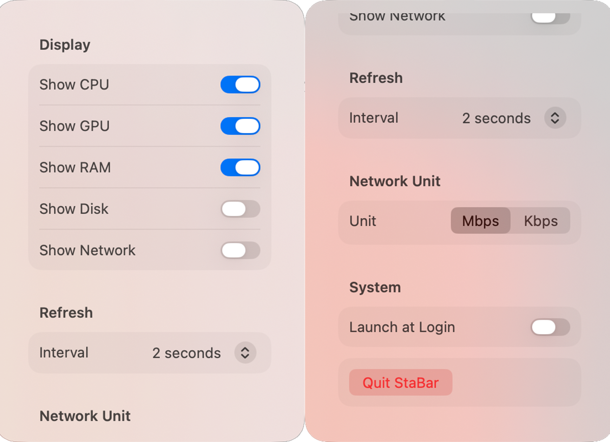
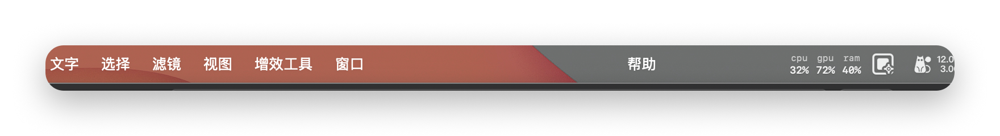
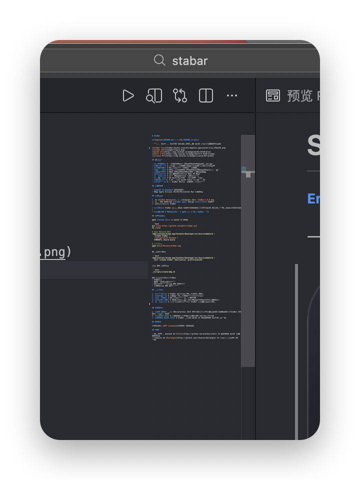

# StaBar

**[English](README.md) | [中文](README_zh.md)**

一款基于 Swift 和 SwiftUI 构建的轻量级原生 macOS 菜单栏系统监控工具。





## 功能特性

- **实时监控** — 一目了然地查看 CPU、GPU、内存、磁盘和网络指标
- **列式布局** — 每个指标独立成列，名称在上、数值在下，完美对齐
- **设置弹窗** — 点击菜单栏图标即可打开设置面板
- **指标开关** — 可单独显示或隐藏 CPU、GPU、内存、磁盘、网络任一指标
- **刷新间隔** — 支持 1秒、2秒、5秒、10秒 四种刷新频率
- **网络单位** — 网络速度可选择显示 Kbps 或 Mbps
- **开机自启** — 通过 SMAppService 实现自动启动
- **原生性能** — 纯 Swift/SwiftUI 开发，资源占用极低
- **macOS 设计** — UI 风格与 macOS Tahoe 设计语言一致
- **精美图标** — 为 StaBar 量身打造的现代风格应用图标

## 系统要求

- **macOS 14 Sonoma** 或更高版本
- 推荐 Apple Silicon (M1/M2/M3)；Intel Mac 同样支持

## 安装方法

1. 从 [GitHub Releases](../../releases) 下载 `StaBar-1.0.0.dmg`
2. 打开 DMG 文件，将 **StaBar.app** 拖拽到 **应用程序** 文件夹
3. 从应用程序启动 StaBar

> **注意：** StaBar 未进行代码签名或公证。首次启动时，macOS 可能会阻止运行。请按以下步骤允许：
>
> **系统设置 → 隐私与安全性 → 向下滚动 → 点击"仍要打开"**

## 从源码构建

需要 **Xcode 15+** 及 macOS 14 SDK。

```bash
git clone https://github.com/wpttt/stabar.git
cd stabar

# 构建 Release 版本
/Applications/Xcode.app/Contents/Developer/usr/bin/xcodebuild \
  -scheme StaBar \
  -configuration Release \
  SYMROOT=./build build

# 启动应用
open build/Release/StaBar.app
```

运行单元测试：

```bash
/Applications/Xcode.app/Contents/Developer/usr/bin/xcodebuild \
  test -scheme StaBar -destination 'platform=macOS'
```

创建 DMG 安装包：

```bash
./scripts/create-dmg.sh
```

DMG 创建脚本会自动完成：
- 编译应用
- 生成所有尺寸的应用图标
- 将自定义图标应用到 DMG 文件本身
- 设置挂载后 DMG 的卷标图标

## 使用说明

1. **启动应用** — StaBar 仅在菜单栏运行，没有主窗口
2. **查看指标** — 系统指标以独立列的形式显示在菜单栏
3. **打开设置** — 点击菜单栏图标打开设置弹窗
4. **自定义配置** — 切换显示哪些指标、设置刷新间隔、选择网络速度单位
5. **开机自启** — 启用"登录时启动"，让 StaBar 随系统登录自动运行

## 界面截图

### 菜单栏显示
StaBar 在菜单栏以清爽的多列布局直接展示系统指标：



### 设置弹窗
点击菜单栏图标打开设置面板：



*截图采用圆角设计，配合 macOS 风格的阴影，呈现精致的视觉效果。*

## 已知限制

## 已知限制

1. **GPU 监控** 使用 IOAccelerator 私有 API，可能在部分系统上不可用。如不可用，StaBar 会优雅地回退显示为 0%。
2. **未代码签名** — 用户首次启动时需在系统设置中手动信任应用。
3. **仅支持 macOS 14+** — StaBar 使用了 macOS 14 引入的现代 SwiftUI 特性。

## 许可证

本项目采用 [MIT License](LICENSE) 许可证。

## 致谢

- 灵感来源于 exelban 的 [Stats](https://github.com/exelban/stats) —— 最全面的 macOS 系统监控工具
- rxhanson 的 [Rectangle](https://github.com/rxhanson/Rectangle) —— 菜单栏和登录项实现参考
